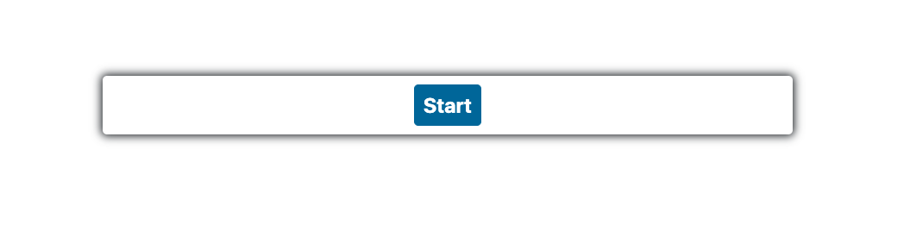
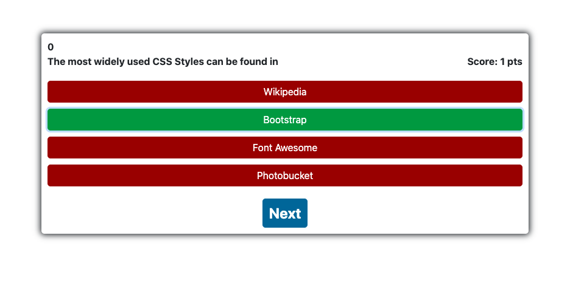

Test your coding knowledge!

When you load the page, the Start button appears. Click it to begin the game. 

You will have 60 seconds for this whole quiz. Hurry up and answer the first question, the timer is already running!

If you select the correct score, your answer will get 1 point. 

If you select the wrong answer, you will lose 10 seconds off the clock. 

Be careful, if you run out of time, the game will be over. You will get a popup "Time's up!"

Once you've reached the end of the questions, or time, you can log your name for all of posterity. 

Gaze at your name among the leaders of the Quiz App!

To try again, hit the Start Over button. 

